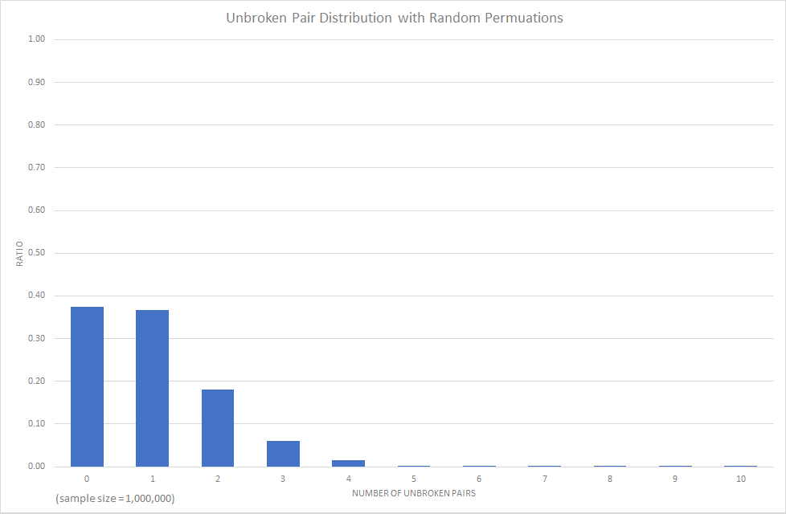
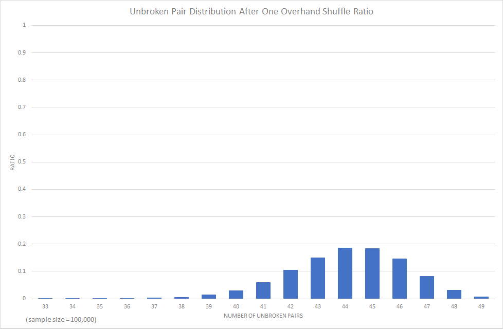
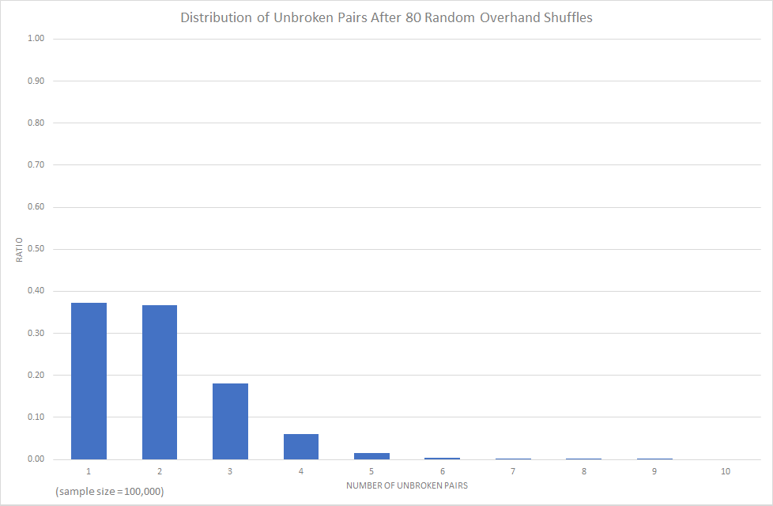

# COSC241 Assignment Report - Semester 1 2017 
`Anthony Dickson 3348967`

## Unbroken Pair Distribution with Random Permutations
### Observations
When generating random permutations of a deck of 50 cards, with a Fisher-Yates shuffle to ensure there is no bias in the randomness, the number of unbroken pairs seems to be normally distributed around an average of about 0.5. That is to say, most (74%) of the time there will be 0 or 1 unbroken pairs, 99.7% of the time there will be up to 4 unbroken pairs, and only 0.3% of the time will we see more than 4 unbroken pairs. 

---

## Unbroken Pair Distribution with Random Overhand Shuffling
### How many random overhand shuffles seem to be necessary so that the number of unbroken pairs behaves as it would for random permutations?
Considering the distribution of unbroken pairs with random permutations, I aimed for a 37% chance for 0 unbroken pairs, and a 37% chance for 1 unbroken pair.

If we were to random overhand shuffle the deck once, the number of unbroken pairs was normally distributed around an average of 45.5, with ~99.7% of the number of unbroken pairs being between 38 and 49. Needless to say, this is nowhere near the distribution of the random permutations and this can be seen by comparing the graphs in Fig. 1 and Fig. 3. Furthermore, any number of shuffles in the range of 1 ~ 30 did not produce any good results. At 40 shuffles however, there is a ~20% chance of 0 unbroken pairs and a ~31% chance of 1 unbroken pair. Close, but still not close enough. At 50 shuffles, there is now a ~30% chance of 0 unbroken pairs and a ~36% chance of 1 unbroken pair. 
 
To achieve a similar distribution of unbroken pairs to that of a deck generated using random permutations, one would need to random overhand shuffle somewhere between 60 ~ 80 times. At 80 shuffles, the distribution of unbroken pairs is almost identical to that of the random permutations, as shown by the graphs Fig. 1 and Fig. 5, and the tables Fig. 2 and Fig. 6.

---

### Fig. 1 Graph of Unbroken Pair Distribution with Random Permutations

### Fig. 2 Table of Unbroken Pair Distribution with Random Permutations
| Number of Unbroken Pairs | Ratio | Percentage |
| ------------------------ | ----- | ---------- |
| 0	    | 0.374966 | ~37% |
| 1	    | 0.367669 | ~37% |
| 2	    | 0.180502 | ~18% |
| 3	    | 0.059301 | ~6% |
| 4	    | 0.014224 | ~1% |
| 5	    | 0.002813 | <1% |
| 6	    | 0.000451 | <1% |
| 7	    | 0.000066 | <1% |
| 8 	| 0.000005 | <1% |
| 9	    | 0.000001 | <1% |
| 10	| 0.000002 | <1% |

### Fig. 3 Graph of Unbroken Pair Distribution After One Random Overhand Shuffle
 

### Fig. 4 Table of Unbroken Pair Distribution After One Random Overhand Shuffle
| Number of Unbroken Pairs | Ratio | Percentage |
| ------------------------ | ----- | ---------- |
| 0~32 | 0 | 0% |
| 33 | 0.00001 | <1% |
| 34 | 0.00006 | <1% |
| 35 | 0.00011 | <1% |
| 36 | 0.00071 | <1% |
| 37 | 0.00202 | <1% |
| 38 | 0.00532 | <1% |
| 39 | 0.01358 | ~1% |
| 40 | 0.02989 | ~3% |
| 41 | 0.05948 | ~6% |
| 42 | 0.10398 | ~10% |
| 43 | 0.15009 | ~15% |
| 44 | 0.18554 | ~19% |
| 45 | 0.18368 | ~18% |
| 46 | 0.14557 | ~15% |
| 47 | 0.08277 | ~8% |
| 48 | 0.03143 | ~3% |
| 49 | 0.00576 | <1% |

## Fig. 5 Graph of Unbroken Pair Distribution After 80 Random Overhand Shuffles

## Fig. 6 Table of Unbroken Pair Distribution After 80 Random Overhand Shuffles
| Number of Unbroken Pairs | Ratio | Percentage |
| ------------------------ | ----- | ---------- |
| 0	    | 0.37336  | ~37% |
| 1	    | 0.3675   | ~37% |
| 2	    | 0.181    | ~18% |
| 3	    | 0.05968  | ~6% |
| 4	    | 0.01494  | ~1% |
| 5	    | 0.00289  | <1% |
| 6	    | 0.00055  | <1% |
| 7	    | 0.00007  | <1% |
| 8 	| 0.00001  | <1% |